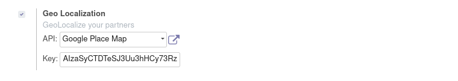
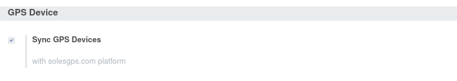
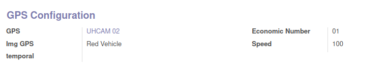

# GPSMAP

This repository contains the GPSMAP module, with which we can geolocate devices using the [SolesGPS](http://solesgps.com) platform.

You can see the functionality in [Odoo15](http://odoo15.solesgps.com:8115).

    User admin
    Pass admin

------------------

## CONFIGURATION TYPES

- 1.- Steps to track android device.
- 2.- Steps to track GPS device.
- 3.- Steps to configure the module.

## 1.- Steps to track android device #####    

1.1- Download and install the hidden application

The application is an apk for android, which needs to get the GPS location of the device, use the internet of the device to connect to the SolesGPS.com server in order to leave information that will be processed by the platform.
    
You can download the hidden application 
    
1.2 Configure the application with the following parameters

    Server:               http://gps.solesgps.com:5055
    Position accuracy:    high
    Scan rate:            60
    Angle:                35
    Distance:             500
    
Remember the value of the device identifier field, this data will be the IMEI, when configuring the device in the GPSMAP module
    
## 2.- Steps to track GPS device. 

2.1- Know the model of the GPS device, in order to determine the protocol to use

2.2- Determine the necessary port, based on the protocol; The GPSMAP module brings the ports that each protocol requires.
    The GPS device can be configured by SMS.

2.2- Configure the GPS device, with the following parameters

    SERVER WITH DOMAIN:   gps.solesgps.com
    SERVER WITH IP:       51.79.79.134
    PORT:                 Determined by the GPS protocol, within the range 5001 - 5240
    FREQUENCY:            60 Seconds
    APN:                  Determined by GSM chip installed in the GPS device
    USER_APN:             Determined by the GSM chip provider
    PASS_APN:             Determined by the GSM chip provider
        
Add the device to the GPSMAP module, using its IMEI.
    

## 3.- Steps to configure the module.
    
3.1- Add the google maps key.

    3.1.1- Activate the Geolocation check
        It is located in the SETTINGS module, GENERAL SETTINGS section, INTEGRATIONS header.

    3.1.2- Save the modification

    3.1.3- In API Select the option: GOOGLE PLACE MAP

    3.1.4- Add Google key

    3.1.5- Save the modification

        
3.2- Synchronize with SolesGPS.

    3.2.1- Activate Sync GPS Devices check
        It is located in the SETTINGS module, FLEET section, GPS DEVICE header.

    3.2.2- Save the modification

3.3 Create GPS device using its IMEI.

    3.3.1- Filling out the form data in GPS / Configuration / GPS Device

    - The IMEI field cannot be repeated, it is unique in the world,

    - In the case of android devices, the imei is a random value, we must replace it in case of duplicate
        

3.4 Match the vehicle with the GPS device.
    
    3.4.1- Enter the vehicle form

    3.4.2- Select the GPS device that comes with the vehicle in the GPS CONFIGURATION section

    